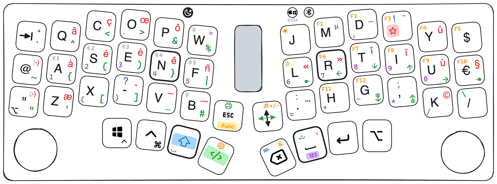
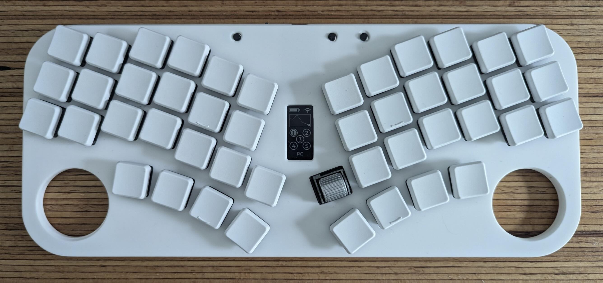

ZMK configuration for dragon46 keyboard.

Not working / still under development
- implement a reset key? (in addition to the button on the back). Same for a bootloader key?
- mouse move not implemeneted
- Tests tests and tests...

Update:
- soft-on / off throug dedicated GPIO button working.  Small issue: latest "default layer" is not saved, therefore when the keyboard was in "MacOS" mode, the status after a soft-on is back to "PC". I will see if I find some parameter to save the base layer when turning off.
