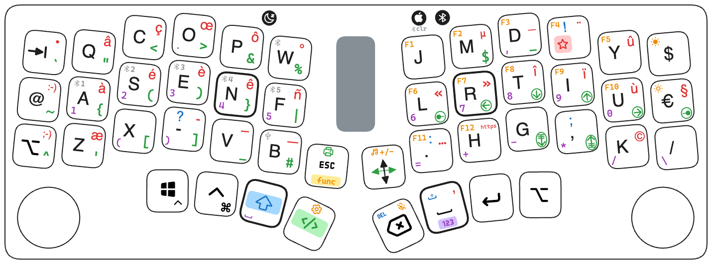

ZMK configuration for dragon46 keyboard (custom PCB with a nice!nanov2, a nice!vew and a rotary encoder)
Ergo-L layout (https://ergol.org) with some adaptations on the "altgr/code" layer to fit navigation keys on the right.
It "emulates" an AZERTY french keyboard, so non-standard keys are injected through key combinaisons (including alt+xxx for Windows specific chars). PC and macOS with a switch button. This is done to comply with any French computer without any configuration (including virtual machines).

|  |  |
| :-: | :-: |
|  |  |

Latest changes:
- soft-on / off. Note that ZMK implements soft-off totally independantly of the sleep.
  - "oft-off" to be used when travelling, wake up only through this key
  - and otherwise wake from sleep with any key.
- move from a numpad to a num row

Not working / still under development
- mouse move not implemeneted (not fully supported in ZMK)
